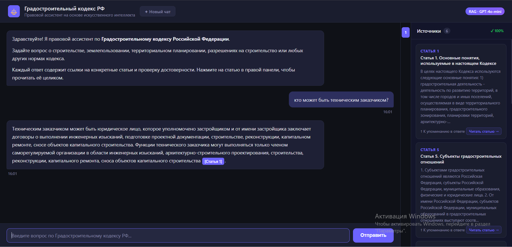
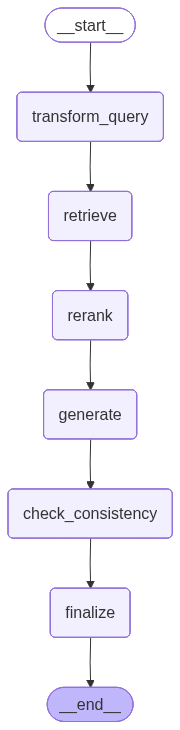

# RAG-система по Градостроительному кодексу РФ

RAG-система (Retrieval-Augmented Generation) для вопросов по Градостроительному кодексу Российской Федерации. Принимает вопросы на естественном языке и возвращает ответы с точными ссылками на статьи кодекса.

**Стек:** FastAPI, LangGraph, LangChain, OpenAI,  FAISS,  BM25,  GPT-4o-mini, Claude



## Установка

```bash
git clone https://github.com/Maxim-Karmanov/grad-codex-rag.git
cd grad-codex-rag

cp .env.example .env   # Заполнить OPENAI_API_KEY
uv sync
```

## Запуск

```bash
uvicorn app.api:app --reload --port 8000
```

## Архитектура пайплайна



Каждый запрос проходит через 6 узлов LangGraph (`app/rag.py`):

| Узел | Описание |
|------|----------|
| `transform_query` | **HyDE** - LLM генерирует гипотетический фрагмент, который мог бы отвечать на вопрос; этот текст используется как запрос вместо исходного вопроса |
| `retrieve` | **Гибридный поиск** - параллельно запускаются BM25 (ключевые слова) и FAISS MMR (семантика), результаты сливаются через Reciprocal Rank Fusion; Статья 1 (основополагающие термины) всегда добавляется в контекст |
| `rerank` | **LLM-ранжирование** - каждый документ оценивается моделью по шкале 1–10 на соответствие вопросу, оставляются топ-5; Статья 1 закреплена и не участвует в ранжировании |
| `generate` | **Генерация ответа** - LLM формирует ответ с обязательными цитатами `[Статья N]`|
| `check_consistency` | **Проверка консистентности** - LLM верифицирует каждое утверждение ответа по исходным фрагментам, возвращает JSON `{verified, unverified, score}` |
| `finalize` | **Финализация** - формирует структурированный список источников `[{article, title, excerpt}]`; добавляет предупреждение если `score < 0.8` |

Граф компилируется с `MemorySaver` - поддерживаются многоходовые диалоги через `thread_id`.

### Поиск (`app/retriever.py`)

- **BM25** - по ~140 статьям с русским токенизатором (`re.findall(r'[а-яёa-z\d]+', text.lower())`)
- **FAISS MMR** - `lambda_mult=0.6`, `k=10`, `fetch_k=20` для семантического разнообразия
- **RRF** - ручная реализация Reciprocal Rank Fusion (`k=60`)
- Эмбеддинги кешируются в `./cache/` через `langchain_classic.CacheBackedEmbeddings`

---

## API

| Метод | Путь | Описание |
|-------|------|----------|
| `GET` | `/` | Веб-интерфейс |
| `POST` | `/api/chat` | RAG-ответ. Тело: `{question, thread_id?}`. Возвращает: `{answer, sources, consistency_score, thread_id}` |
| `GET` | `/api/article/{n}` | Полный текст статьи N из FAISS-хранилища |
| `GET` | `/api/health` | Проверка доступности |
---

## Структура проекта

```
grad-codex-rag/
├── app/
|   ├── api.py          # FastAPI эндпоинты
|   ├── rag.py          # LangGraph pipeline (6 узлов)
|   ├── retriever.py    # Гибридный поиск BM25 + FAISS MMR
|   └── llms.py         # Инициализация LLM и эмбеддингов
├── static/
|   └── index.html      # Веб-интерфейс (написан Claude)
├── faiss_index/        # Предсобранный FAISS-индекс
├── data/
└── assets/
```